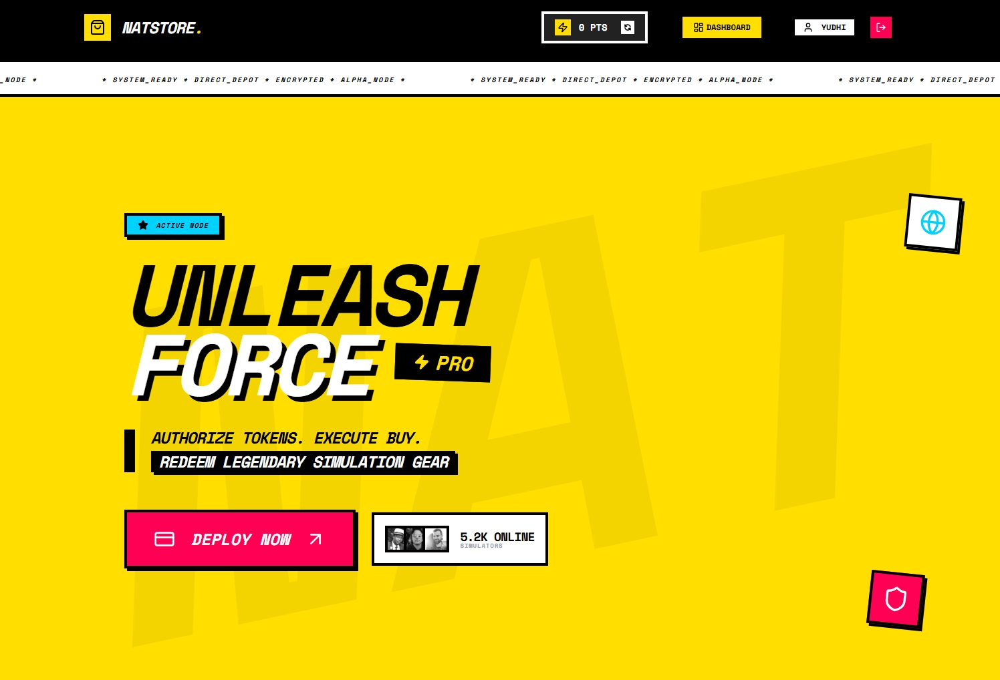
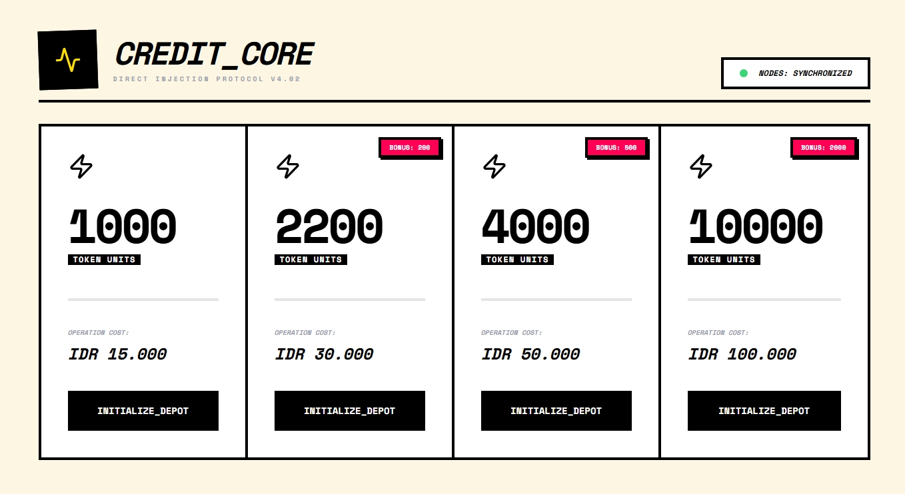
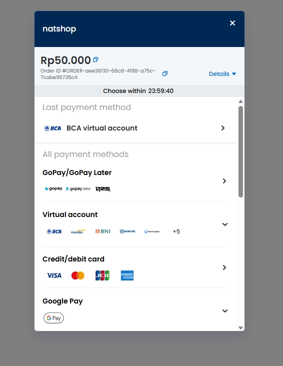

# NATSTORE
### High-Velocity Neobrutalist Simulation Store

NATSTORE is a production-grade digital asset simulation platform built with a hardened security posture and a high-impact Neobrutalist design system. It features seamless Midtrans payment integration, advanced GSAP motion graphics, and a robust Node.js backend.


*Protocol Alpha: Dynamic Hero Interface*

---

## Key Features

- **⚡ Instant Credit Injection**: Real-time point top-ups via Midtrans Snap SDK.
- **Loot Vault Protocol**: Exclusive digital rewards redemption system with automated credit deduction.
- **Hardened Security**: Backend protected by Express Rate Limit, Helmet headers, and Zod input validation.
- **Industrial UI/UX**: High-contrast Neobrutalist design with advanced GSAP ScrollTrigger animations.
- **Identity Management**: Secure JWT-based authentication with "System Access Terminal" aesthetics.

---

## Core Modules

### 1. Points Dispensary
A high-performance "Power Grid" layout for point acquisition with instant sync.


### 2. Secure Payment Gateway
Seamless integration with Midtrans for credit card, bank transfer, and e-wallet transactions.


---

## Tech Stack

| Layer | Technologies |
| :--- | :--- |
| **Frontend** | Next.js 15+, Tailwind CSS, GSAP, Lucide React, Axios |
| **Backend** | Node.js, Express, Prisma ORM, JSON Web Tokens (JWT) |
| **Database** | PostgreSQL / MySQL |
| **Integration** | Midtrans Payment Gateway (Snap SDK) |
| **Validation** | Zod (Schema Validation), Helmet (Security Headers) |

---

## Getting Started

### Prerequisites

- Node.js (v18+)
- Database Instance (PostgreSQL/MySQL)
- Midtrans Server/Client Keys

### Environment Setup

Create `.env` files in both `backend` and `frontend` directories:

**Backend `.env`:**
```env
DATABASE_URL="your_db_url"
JWT_SECRET="your_secret_key"
MIDTRANS_SERVER_KEY="your_server_key"
FRONTEND_URL="http://localhost:3000"
```

**Frontend `.env.local`:**
```env
NEXT_PUBLIC_API_URL="http://localhost:5000/api"
NEXT_PUBLIC_MIDTRANS_CLIENT_KEY="your_client_key"
```

### Installation

1. **Install Dependencies:**
   ```bash
   # Root
   npm install

   # Frontend
   cd frontend && npm install

   # Backend
   cd backend && npm install
   ```

2. **Initialize Database:**
   ```bash
   cd backend
   npx prisma generate
   npx prisma db push
   ```

3. **Deploy Locally:**
   ```bash
   # Run Backend (Port 5000)
   cd backend && npm start

   # Run Frontend (Port 3000)
   cd frontend && npm run dev
   ```

---

> [!IMPORTANT]
> This repository is designed for educational simulations. Ensure all API keys are managed via environment variables and never committed to version control.

> [!TIP]
> Use the "System Status" indicators in the navbar to verify connection stability during payment injections.
